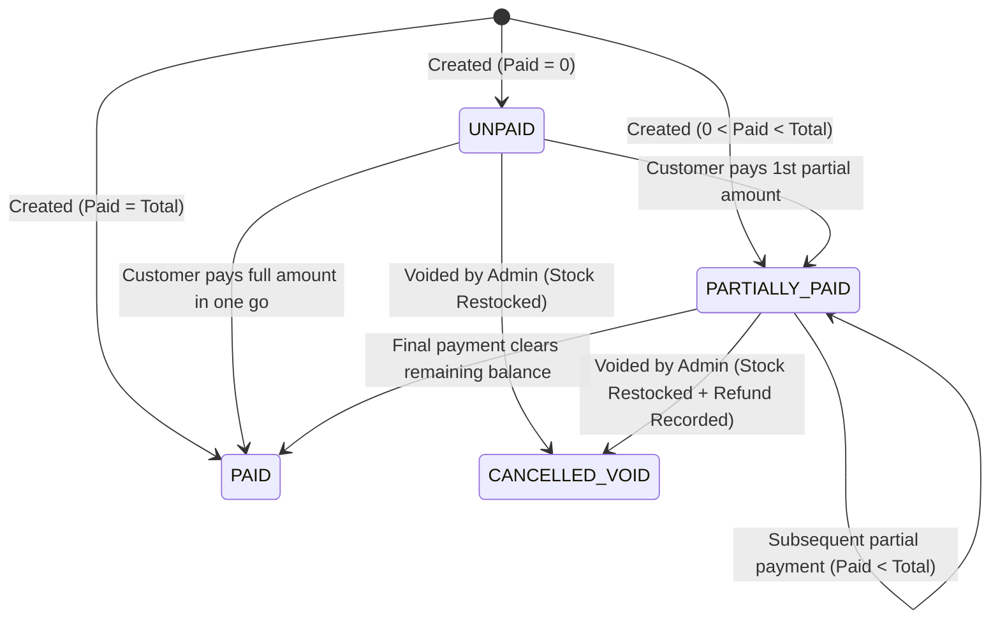
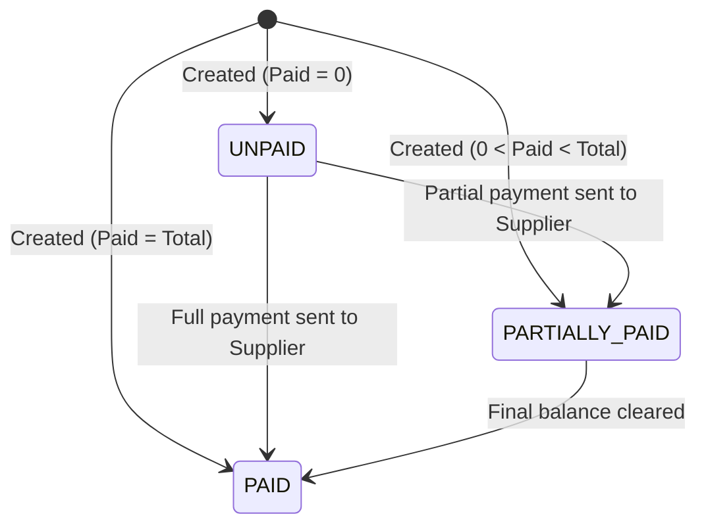

# Phase 2: Use Cases & Business Rules Specification
**Project Name:** Stock & Inventory Management System  
**Document Version:** 1.0.0  
**Phase:** Phase 2 of 19  
**Status:** Approved Blueprint for Database & Application Architecture  

---

## 1. Executive Summary & Objective

The purpose of this document is to define the exact **mathematical formulas, state machines, business invariants, and transactional workflows** that govern the application. 

In a production business system handling large sums of money and high volumes of goods, ambiguous business rules cause financial discrepancies, negative stock, and data corruption. This document serves as the absolute source of truth for all database constraints and backend business logic.

---

## 2. Core Business Invariants (Non-Negotiable System Rules)

```
+-----------------------------------------------------------------------------------+
|                        SYSTEM-WIDE BUSINESS INVARIANTS                            |
+-----------------------------------------------------------------------------------+
|  1. ATOMICITY: No financial or stock change exists outside a DB::transaction.     |
|  2. IMMUTABILITY: Stock ledger and payment records are never edited or deleted.   |
|  3. NO SILENT OVERWRITES: Balances are calculated from transaction histories.     |
|  4. HIGH PRECISION: All currency stored as DECIMAL(18, 2) (Up to 999 Trillion).   |
|  5. NON-NEGATIVE STOCK: A sale cannot decrement stock below 0.                    |
|  6. SAFE DELETION: Master records with historical transactions cannot be deleted. |
+-----------------------------------------------------------------------------------+
```

1. **Rule of Atomicity (ACID):** Every operation that modifies stock, balances, or payments **must** execute inside a database transaction (`DB::transaction()`). If any single step fails, the entire batch rolls back with zero side-effects.
2. **Rule of Stock Non-Negativity:** Physical inventory (`current_stock`) can never drop below zero (`current_stock >= 0`). If a sale requests 5 units and only 4 are available, the transaction **must** be rejected before any database modification.
3. **Rule of High-Precision Currency:** All monetary values (cost, selling price, discounts, invoice totals, paid amounts, remaining balances) are stored in MySQL as `DECIMAL(18, 2)` (or `DECIMAL(18, 4)` for fractional unit costs). Floating-point (`FLOAT`, `DOUBLE`) data types are strictly prohibited.
4. **Rule of Immutable Financial Records:** Completed sales invoices, purchase orders, stock transaction entries, and payment receipts cannot be edited or hard-deleted. Corrections must be handled via **reversal/adjustment transactions** (e.g., Credit Notes, Stock Adjustments, Void records).
5. **Rule of Referential Integrity (No Orphaned Records):** Categories, Products, Customers, or Suppliers with existing transaction history cannot be deleted (`RESTRICT` on foreign keys). They can only be set to `is_active = false`.
6. **Rule of Concurrency Safety:** Whenever stock is checked and decremented during a sale, the relevant product database row must be locked using `SELECT ... FOR UPDATE` within the transaction to prevent race conditions during simultaneous sales.

---

## 3. Financial Calculation Formulas & Standards

### 3.1 Purchase Order Calculations (Stock In)
For each line item $i$ in a Purchase Order:
$$\text{Line Cost}_i = \text{Quantity}_i \times \text{Unit Purchase Price}_i$$
$$\text{Purchase Total} = \sum_{i=1}^{n} \text{Line Cost}_i + \text{Shipping/Additional Cost} - \text{Supplier Discount}$$
$$\text{Remaining Supplier Balance} = \text{Purchase Total} - \text{Total Amount Paid to Supplier}$$

### 3.2 Sales Invoice Calculations (Stock Out)
For each line item $j$ in a Sales Invoice:
$$\text{Line Subtotal}_j = \text{Quantity}_j \times \text{Unit Selling Price}_j$$
$$\text{Line Discount}_j = \text{Line Subtotal}_j \times \left(\frac{\text{Discount \%}}{100}\right) \quad \text{OR} \quad \text{Fixed Line Discount}$$
$$\text{Line Net Total}_j = \text{Line Subtotal}_j - \text{Line Discount}_j$$
$$\text{Invoice Gross Subtotal} = \sum_{j=1}^{m} \text{Line Net Total}_j$$
$$\text{Invoice Final Total} = \text{Invoice Gross Subtotal} - \text{Invoice Overall Discount} + \text{Tax}$$
$$\text{Invoice Remaining Balance} = \text{Invoice Final Total} - \sum \text{Validated Customer Payments}$$

### 3.3 Customer & Supplier Aggregate Balances
* **Customer Total Debt (Receivables):**
$$\text{Customer Outstanding Balance} = \sum \text{All Unpaid/Partial Sale Invoice Remaining Balances}$$
* **Supplier Total Debt (Payables):**
$$\text{Supplier Outstanding Balance} = \sum \text{All Unpaid/Partial Purchase Invoice Remaining Balances}$$

### 3.4 Gross Profit Calculation
For any completed sales line item:
$$\text{Item Unit Margin} = \text{Effective Selling Price} - \text{Weighted Unit Purchase Cost}$$
$$\text{Gross Profit} = \sum (\text{Item Unit Margin} \times \text{Quantity Sold}) - \text{Invoice Discounts}$$

---

## 4. State Machines & Status Transitions

### 4.1 Sales Invoice State Machine



| Current Status | Event / Trigger | Condition | New Status | Stock Effect |
|:---|:---|:---|:---|:---|
| *New* | Submit Sale | Initial Paid == 0 | `UNPAID` | Stock Decremented |
| *New* | Submit Sale | 0 < Initial Paid < Total | `PARTIALLY_PAID` | Stock Decremented |
| *New* | Submit Sale | Initial Paid == Total | `PAID` | Stock Decremented |
| `UNPAID` | Add Payment | Payment < Remaining | `PARTIALLY_PAID` | None (Financial only) |
| `UNPAID` | Add Payment | Payment == Remaining | `PAID` | None (Financial only) |
| `PARTIALLY_PAID`| Add Payment | Payment == Remaining | `PAID` | None (Financial only) |
| `UNPAID` / `PARTIAL`| Void/Cancel Invoice | Admin Auth | `CANCELLED` | **Stock Restored** via `ADJUSTMENT` / `REVERSAL` |

---

### 4.2 Purchase Order State Machine



---

### 4.3 Stock Movement Ledger State Machine

Every physical item entering or leaving the premises creates an append-only entry in `stock_transactions`:

| Transaction Type | Direction | Quantity Sign | Example Trigger |
|:---|:---:|:---:|:---|
| `PURCHASE` | Inbound | `+` (Positive) | Confirming incoming goods from Supplier |
| `SALE` | Outbound | `-` (Negative) | Confirming customer invoice |
| `CUSTOMER_RETURN` | Inbound | `+` (Positive) | Customer returns undamaged item to store |
| `SUPPLIER_RETURN` | Outbound | `-` (Negative) | Defective item returned back to Supplier |
| `ADJUSTMENT_ADD` | Inbound | `+` (Positive) | Found extra stock during physical shelf audit |
| `ADJUSTMENT_SUB` | Outbound | `-` (Negative) | Stock shrinkage, damage, expired goods |

---

## 5. Detailed Use Cases & Workflows

### 📌 UC-01: Record Inbound Purchase (Stock-In)
* **Primary Actor:** Admin
* **Pre-conditions:** Active Supplier and Products exist in database.
* **Main Success Scenario:**
  1. Admin navigates to **Purchases $\rightarrow$ New Purchase**.
  2. Admin selects Supplier, enters Purchase Date and Supplier Invoice Reference #.
  3. Admin adds line items (Product, Quantity, Unit Cost).
  4. System calculates line totals and grand total in real-time.
  5. Admin enters initial amount paid (e.g., $0$ for credit purchase, or partial/full amount).
  6. Admin clicks **Confirm Purchase**.
  7. **Backend Atomic Execution (`DB::transaction`):**
     - Validate inputs (quantities $> 0$, unit costs $\ge 0$).
     - Create record in `purchases` table.
     - Insert records into `purchase_items` table.
     - For each item: increment `products.current_stock` by the purchased quantity.
     - Insert record into `stock_transactions` (`type = PURCHASE`, `quantity = +Qty`, `balance_after`).
     - If initial payment $> 0$: insert payment record in `supplier_payments` table.
     - Create entry in `audit_logs`.
  8. System redirects to Purchase Details with success message.
* **Post-conditions:** Stock increased immediately; supplier payable balance updated.

---

### 📌 UC-02: Create & Finalize Sales Invoice (Stock-Out)
* **Primary Actor:** Admin
* **Pre-conditions:** Products have `current_stock > 0`.
* **Main Success Scenario:**
  1. Admin navigates to **Sales $\rightarrow$ New Sale**.
  2. Admin selects Customer (or Walk-in / Cash Customer) and Sale Date.
  3. Admin searches and adds products, specifying quantity, selling price, and line discount.
  4. System computes subtotal, taxes, overall discount, and net payable.
  5. Admin enters initial payment amount collected and selects payment method (Cash, Bank Transfer, POS/Card, Cheque).
  6. Admin clicks **Complete Sale**.
  7. **Backend Atomic Execution (`DB::transaction` with Row Locks):**
     - Lock all selected product rows: `Product::whereIn('id', $ids)->lockForUpdate()->get()`.
     - **Strict Validation:** Check if `product.current_stock >= requested_quantity` for every item. If any item is insufficient, **Abort and Throw Exception: "Insufficient stock for [Product Name]. Available: X, Requested: Y"**.
     - Generate unique sequential invoice number (e.g., `INV-202610-0001`).
     - Create record in `sales` table with payment status (`PAID`, `PARTIALLY_PAID`, or `UNPAID`).
     - Insert line items into `sale_items` table.
     - For each item: decrement `products.current_stock` by sold quantity.
     - Insert record into `stock_transactions` (`type = SALE`, `quantity = -Qty`, `balance_after`).
     - If initial payment $> 0$: insert record into `customer_payments` table.
     - Record `audit_logs` entry.
  8. System redirects to Printable Invoice view.
* **Post-conditions:** Stock decremented safely; customer debt updated if balance $> 0$.

---

### 📌 UC-03: Process Customer Debt Installment Payment
* **Primary Actor:** Admin
* **Pre-conditions:** Customer has one or more Sales with status `UNPAID` or `PARTIALLY_PAID`.
* **Main Success Scenario:**
  1. Admin navigates to **Credit Management $\rightarrow$ Customer Payments** (or directly from Customer Profile).
  2. Admin selects Customer and views list of unpaid/partially paid sales.
  3. Admin chooses a specific Sale Invoice (or general account payment).
  4. Admin enters: Payment Amount, Payment Date, Payment Method (Cash/Bank/Card/Cheque), Reference/Receipt Number, and Notes.
  5. Admin clicks **Save Payment**.
  6. **Backend Atomic Execution (`DB::transaction`):**
     - Validate payment amount: Must be $> 0$ and $\le \text{Sale Remaining Balance}$.
     - Lock sale row with `lockForUpdate()`.
     - Insert record into `customer_payments`.
     - Recalculate total paid for the sale.
     - Update `sales.amount_paid` and `sales.remaining_balance`.
     - Update `sales.payment_status` (`PARTIALLY_PAID` or `PAID` if remaining balance is $0.00$).
     - Create entry in `audit_logs`.
  7. System displays printable payment receipt.
* **Post-conditions:** Remaining debt reduced; customer account statement reflects payment.

---

### 📌 UC-04: Perform Physical Stock Adjustment (Audit / Damage)
* **Primary Actor:** Admin
* **Pre-conditions:** Product exists in the system.
* **Main Success Scenario:**
  1. Admin navigates to **Inventory $\rightarrow$ Stock Adjustments $\rightarrow$ New Adjustment**.
  2. Admin selects Product and chooses Adjustment Type:
     - `ADDITION` (e.g., found unrecorded stock)
     - `SUBTRACTION` (e.g., damaged goods, expired, theft/shrinkage)
  3. Admin enters: Quantity, Mandatory Reason/Note (e.g., "Annual physical inventory audit - shelf discrepancy").
  4. Admin clicks **Submit Adjustment**.
  5. **Backend Atomic Execution (`DB::transaction`):**
     - Lock product row.
     - If `SUBTRACTION`, ensure `product.current_stock >= quantity`.
     - Update `product.current_stock`.
     - Create record in `stock_transactions` with `type = ADJUSTMENT_ADD` or `ADJUSTMENT_SUB`, storing previous stock and new stock.
     - Write entry into `audit_logs` detailing user, reason, old stock, and new stock.
* **Post-conditions:** Stock ledger reflects the manual adjustment with full audit traceability.

---

### 📌 UC-05: Low-Stock Real-Time Detection
* **Trigger:** Triggered automatically whenever stock decrements (Sale or Subtraction Adjustment), or rendered on Dashboard.
* **Business Rule:**
  $$\text{Alert Triggered} \iff \text{product.current_stock} \le \text{product.minimum_stock_level}$$
* **System Action:**
  - Product flagged with prominent warning badge (`LOW STOCK` or `OUT OF STOCK`).
  - Item listed on Dashboard **Low Stock Alert Table** with "Reorder" quick-action button pre-filling a Purchase Order.

---

## 6. Edge Cases & Error Handling Matrix

| Scenario | Possible Risk | System Mitigation / Business Rule |
|:---|:---|:---|
| **Simultaneous checkout of last item by 2 users** | Race condition leading to negative stock | Database row locking (`Product::lockForUpdate()`) ensures transaction 1 completes before transaction 2 checks stock. Transaction 2 receives clean "Insufficient stock" validation error. |
| **Network disconnection during sale submission** | Partial data saved (Sale recorded without stock deduction) | All database mutations wrapped in `DB::transaction()`. If connection breaks before commit, MySQL rolls back all changes completely. |
| **Attempt to delete a Product with sales history** | Broken historical sales invoices and reports | Foreign key constraint `ON DELETE RESTRICT`. UI only permits setting `is_active = false` (Archive/Deactivate). |
| **Attempt to delete a Category with linked products** | Orphaned product records | System blocks category deletion if `products_count > 0`. User must reassign products first. |
| **Payment amount exceeds invoice balance** | Negative balance / overpayment confusion | Form Request validation ensures `amount <= sale.remaining_balance`. Overpayment is rejected at the validator level. |
| **Duplicate invoice number generation** | Database crash on unique constraint | Invoice generator uses transactional atomic sequencing format (`INV-YYYYMM-XXXX`) combined with MySQL unique index constraint. |
| **Product selling price lower than cost price** | Accidental loss on sale | Form displays a non-blocking warning badge: *"Warning: Selling price ($X) is lower than unit cost ($Y)"* to allow intentional clearance sales while preventing accidental typos. |

---

## 7. Approval & Sign-Off

This document finalizes the operational logic and invariants for the system. With this blueprint established, we proceed to **Phase 3: Database ER Design & Schemas**.

**Status:** Ready for Phase 3 Architecture Design.
