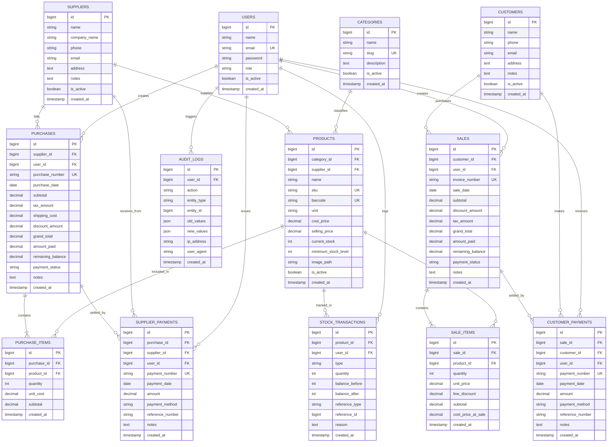

# Phase 3: Database Architecture & Entity-Relationship (ER) Specification
**Project Name:** Stock & Inventory Management System  
**Document Version:** 1.0.0  
**Phase:** Phase 3 of 19  
**Status:** Approved Architecture Blueprint for Laravel Migrations & Models  

---

## 1. Executive Summary & Design Principles

This document defines the complete physical and logical relational database schema for the **Stock & Inventory Management System**. The schema is engineered to guarantee:
1. **Financial Precision:** All monetary amounts use `DECIMAL(18, 2)` to eliminate floating-point rounding errors.
2. **Double-Entry Style Auditing:** Stock changes are never directly overwritten without generating an immutable record in `stock_transactions`.
3. **Historical Profit Accuracy:** Sales line items capture `cost_price_at_sale` at the exact moment of purchase, preserving historical gross profit analytics even if catalog cost prices fluctuate.
4. **Referential Integrity & Concurrency:** Foreign keys enforce `RESTRICT` on transactional histories to prevent orphaned records, paired with indexed lookup keys (`SKU`, `Invoice #`, `Purchase #`).

---

## 2. Entity-Relationship (ER) Diagram

---

## 3. Detailed Table Definitions & Data Dictionary

### 3.1 Table: `users`
Manages administrative users and authentication credentials.

| Column | Type | Nullable | Default | Constraints & Index | Description |
|:---|:---|:---:|:---:|:---|:---|
| `id` | `BIGINT UNSIGNED` | NO | Auto | `PRIMARY KEY` | Unique User ID |
| `name` | `VARCHAR(255)` | NO | - | - | Full Name |
| `email` | `VARCHAR(255)` | NO | - | `UNIQUE INDEX` | Login Email |
| `password` | `VARCHAR(255)` | NO | - | - | Argon2id / Bcrypt Hash |
| `role` | `VARCHAR(50)` | NO | `'ADMIN'` | `INDEX` | User role (`ADMIN`, `STAFF`) |
| `is_active` | `BOOLEAN` | NO | `TRUE` | `INDEX` | Active status |
| `remember_token` | `VARCHAR(100)` | YES | `NULL` | - | Session remember token |
| `created_at` | `TIMESTAMP` | YES | `NULL` | - | Creation timestamp |
| `updated_at` | `TIMESTAMP` | YES | `NULL` | - | Modification timestamp |

---

### 3.2 Table: `categories`
Organizes products into business categories.

| Column | Type | Nullable | Default | Constraints & Index | Description |
|:---|:---|:---:|:---:|:---|:---|
| `id` | `BIGINT UNSIGNED` | NO | Auto | `PRIMARY KEY` | Category ID |
| `name` | `VARCHAR(150)` | NO | - | `INDEX` | Category display name |
| `slug` | `VARCHAR(180)` | NO | - | `UNIQUE INDEX` | URL-friendly unique identifier |
| `description` | `TEXT` | YES | `NULL` | - | Category details |
| `is_active` | `BOOLEAN` | NO | `TRUE` | `INDEX` | Visibility status |
| `created_at` | `TIMESTAMP` | YES | `NULL` | - | Record created |
| `updated_at` | `TIMESTAMP` | YES | `NULL` | - | Record updated |

---

### 3.3 Table: `suppliers`
Maintains vendors and procurement partners.

| Column | Type | Nullable | Default | Constraints & Index | Description |
|:---|:---|:---:|:---:|:---|:---|
| `id` | `BIGINT UNSIGNED` | NO | Auto | `PRIMARY KEY` | Supplier ID |
| `name` | `VARCHAR(200)` | NO | - | `INDEX` | Contact person name |
| `company_name` | `VARCHAR(255)` | YES | `NULL` | `INDEX` | Registered business name |
| `phone` | `VARCHAR(50)` | NO | - | `INDEX` | Contact phone number |
| `email` | `VARCHAR(255)` | YES | `NULL` | - | Email address |
| `address` | `TEXT` | YES | `NULL` | - | Physical location address |
| `notes` | `TEXT` | YES | `NULL` | - | Internal administrative notes |
| `is_active` | `BOOLEAN` | NO | `TRUE` | `INDEX` | Active vendor status |
| `created_at` | `TIMESTAMP` | YES | `NULL` | - | Record created |
| `updated_at` | `TIMESTAMP` | YES | `NULL` | - | Record updated |

---

### 3.4 Table: `customers`
Maintains client profiles and credit accounts.

| Column | Type | Nullable | Default | Constraints & Index | Description |
|:---|:---|:---:|:---:|:---|:---|
| `id` | `BIGINT UNSIGNED` | NO | Auto | `PRIMARY KEY` | Customer ID |
| `name` | `VARCHAR(200)` | NO | - | `INDEX` | Customer full name |
| `phone` | `VARCHAR(50)` | YES | `NULL` | `INDEX` | Phone number |
| `email` | `VARCHAR(255)` | YES | `NULL` | - | Email address |
| `address` | `TEXT` | YES | `NULL` | - | Delivery / Billing address |
| `notes` | `TEXT` | YES | `NULL` | - | Special terms or notes |
| `is_active` | `BOOLEAN` | NO | `TRUE` | `INDEX` | Active status |
| `created_at` | `TIMESTAMP` | YES | `NULL` | - | Record created |
| `updated_at` | `TIMESTAMP` | YES | `NULL` | - | Record updated |

---

### 3.5 Table: `products`
The core catalog table holding inventory balances and pricing.

| Column | Type | Nullable | Default | Constraints & Index | Description |
|:---|:---|:---:|:---:|:---|:---|
| `id` | `BIGINT UNSIGNED` | NO | Auto | `PRIMARY KEY` | Product ID |
| `category_id` | `BIGINT UNSIGNED` | NO | - | `FK -> categories(id) RESTRICT` | Associated category |
| `supplier_id` | `BIGINT UNSIGNED` | YES | `NULL` | `FK -> suppliers(id) RESTRICT` | Default/preferred supplier |
| `name` | `VARCHAR(255)` | NO | - | `INDEX` | Product name |
| `sku` | `VARCHAR(100)` | NO | - | `UNIQUE INDEX` | Stock Keeping Unit |
| `barcode` | `VARCHAR(100)` | YES | `NULL` | `UNIQUE INDEX` | UPC/EAN Barcode |
| `unit` | `VARCHAR(50)` | NO | `'Pcs'` | - | Unit of measure (Pcs, Kg, Box, Litre) |
| `cost_price` | `DECIMAL(18, 2)` | NO | `0.00` | - | Current purchase unit cost |
| `selling_price`| `DECIMAL(18, 2)` | NO | `0.00` | `INDEX` | Standard retail selling price |
| `current_stock`| `INT` | NO | `0` | `INDEX` | Physical stock on hand |
| `minimum_stock_level` | `INT` | NO | `5` | `INDEX` | Reorder threshold level |
| `image_path` | `VARCHAR(500)` | YES | `NULL` | - | Stored product image URL/path |
| `description`| `TEXT` | YES | `NULL` | - | Product specifications/description |
| `is_active` | `BOOLEAN` | NO | `TRUE` | `INDEX` | Availability status |
| `created_at` | `TIMESTAMP` | YES | `NULL` | - | Record created |
| `updated_at` | `TIMESTAMP` | YES | `NULL` | - | Record updated |

---

### 3.6 Table: `purchases`
Purchase Orders and Stock-In records.

| Column | Type | Nullable | Default | Constraints & Index | Description |
|:---|:---|:---:|:---:|:---|:---|
| `id` | `BIGINT UNSIGNED` | NO | Auto | `PRIMARY KEY` | Purchase ID |
| `supplier_id` | `BIGINT UNSIGNED` | NO | - | `FK -> suppliers(id) RESTRICT` | Supplier ID |
| `user_id` | `BIGINT UNSIGNED` | NO | - | `FK -> users(id) RESTRICT` | Admin who created purchase |
| `purchase_number` | `VARCHAR(100)` | NO | - | `UNIQUE INDEX` | Reference (e.g. `PO-202610-0001`) |
| `purchase_date` | `DATE` | NO | - | `INDEX` | Date goods received |
| `subtotal` | `DECIMAL(18, 2)` | NO | `0.00` | - | Sum of line item costs |
| `tax_amount` | `DECIMAL(18, 2)` | NO | `0.00` | - | Inbound tax/VAT |
| `shipping_cost` | `DECIMAL(18, 2)` | NO | `0.00` | - | Freight & logistics cost |
| `discount_amount`| `DECIMAL(18, 2)` | NO | `0.00` | - | Total supplier discount |
| `grand_total` | `DECIMAL(18, 2)` | NO | `0.00` | `INDEX` | Net total payable to supplier |
| `amount_paid` | `DECIMAL(18, 2)` | NO | `0.00` | - | Total amount settled |
| `remaining_balance` | `DECIMAL(18, 2)` | NO | `0.00` | `INDEX` | Outstanding debt on invoice |
| `payment_status` | `VARCHAR(30)` | NO | `'UNPAID'` | `INDEX` | `PAID`, `PARTIALLY_PAID`, `UNPAID` |
| `notes` | `TEXT` | YES | `NULL` | - | Purchase invoice notes |
| `created_at` | `TIMESTAMP` | YES | `NULL` | - | Record created |
| `updated_at` | `TIMESTAMP` | YES | `NULL` | - | Record updated |

---

### 3.7 Table: `purchase_items`
Individual line items in a purchase record.

| Column | Type | Nullable | Default | Constraints & Index | Description |
|:---|:---|:---:|:---:|:---|:---|
| `id` | `BIGINT UNSIGNED` | NO | Auto | `PRIMARY KEY` | Purchase Line ID |
| `purchase_id` | `BIGINT UNSIGNED` | NO | - | `FK -> purchases(id) CASCADE` | Parent purchase header |
| `product_id` | `BIGINT UNSIGNED` | NO | - | `FK -> products(id) RESTRICT` | Product purchased |
| `quantity` | `INT` | NO | - | - | Quantity received ($> 0$) |
| `unit_cost` | `DECIMAL(18, 2)` | NO | `0.00` | - | Cost per unit on this batch |
| `subtotal` | `DECIMAL(18, 2)` | NO | `0.00` | - | `quantity * unit_cost` |
| `created_at` | `TIMESTAMP` | YES | `NULL` | - | Record created |
| `updated_at` | `TIMESTAMP` | YES | `NULL` | - | Record updated |

---

### 3.8 Table: `supplier_payments`
Tracks payments made to suppliers against purchase orders.

| Column | Type | Nullable | Default | Constraints & Index | Description |
|:---|:---|:---:|:---:|:---|:---|
| `id` | `BIGINT UNSIGNED` | NO | Auto | `PRIMARY KEY` | Payment ID |
| `purchase_id` | `BIGINT UNSIGNED` | NO | - | `FK -> purchases(id) RESTRICT` | Associated purchase order |
| `supplier_id` | `BIGINT UNSIGNED` | NO | - | `FK -> suppliers(id) RESTRICT` | Supplier receiving payment |
| `user_id` | `BIGINT UNSIGNED` | NO | - | `FK -> users(id) RESTRICT` | Admin who issued payment |
| `payment_number` | `VARCHAR(100)` | NO | - | `UNIQUE INDEX` | Voucher # (`SPAY-202610-0001`) |
| `payment_date` | `DATE` | NO | - | `INDEX` | Date payment cleared |
| `amount` | `DECIMAL(18, 2)` | NO | - | - | Amount paid ($> 0$) |
| `payment_method` | `VARCHAR(50)` | NO | `'CASH'` | - | `CASH`, `BANK_TRANSFER`, `CHEQUE`, `CARD` |
| `reference_number`| `VARCHAR(150)` | YES | `NULL` | `INDEX` | Bank slip / Cheque # / Ref |
| `notes` | `TEXT` | YES | `NULL` | - | Remarks |
| `created_at` | `TIMESTAMP` | YES | `NULL` | - | Record created |
| `updated_at` | `TIMESTAMP` | YES | `NULL` | - | Record updated |

---

### 3.9 Table: `sales`
Sales orders and invoices for stock-out transactions.

| Column | Type | Nullable | Default | Constraints & Index | Description |
|:---|:---|:---:|:---:|:---|:---|
| `id` | `BIGINT UNSIGNED` | NO | Auto | `PRIMARY KEY` | Sale ID |
| `customer_id` | `BIGINT UNSIGNED` | YES | `NULL` | `FK -> customers(id) RESTRICT` | Customer (`NULL` = Walk-in Cash) |
| `user_id` | `BIGINT UNSIGNED` | NO | - | `FK -> users(id) RESTRICT` | Admin who created invoice |
| `invoice_number` | `VARCHAR(100)` | NO | - | `UNIQUE INDEX` | Unique invoice # (`INV-202610-0001`) |
| `sale_date` | `DATE` | NO | - | `INDEX` | Date of sale |
| `subtotal` | `DECIMAL(18, 2)` | NO | `0.00` | - | Sum of line subtotals |
| `discount_amount`| `DECIMAL(18, 2)` | NO | `0.00` | - | Overall order discount |
| `tax_amount` | `DECIMAL(18, 2)` | NO | `0.00` | - | Tax / VAT applied |
| `grand_total` | `DECIMAL(18, 2)` | NO | `0.00` | `INDEX` | Net total payable by customer |
| `amount_paid` | `DECIMAL(18, 2)` | NO | `0.00` | - | Total amount collected |
| `remaining_balance` | `DECIMAL(18, 2)` | NO | `0.00` | `INDEX` | Customer credit/debt balance |
| `payment_status` | `VARCHAR(30)` | NO | `'UNPAID'` | `INDEX` | `PAID`, `PARTIALLY_PAID`, `UNPAID`, `VOID` |
| `notes` | `TEXT` | YES | `NULL` | - | Special terms or notes |
| `created_at` | `TIMESTAMP` | YES | `NULL` | `INDEX` | Record created |
| `updated_at` | `TIMESTAMP` | YES | `NULL` | - | Record updated |

---

### 3.10 Table: `sale_items`
Detailed line items for each sales transaction.

| Column | Type | Nullable | Default | Constraints & Index | Description |
|:---|:---|:---:|:---:|:---|:---|
| `id` | `BIGINT UNSIGNED` | NO | Auto | `PRIMARY KEY` | Sale Item ID |
| `sale_id` | `BIGINT UNSIGNED` | NO | - | `FK -> sales(id) CASCADE` | Parent sales invoice |
| `product_id` | `BIGINT UNSIGNED` | NO | - | `FK -> products(id) RESTRICT` | Product sold |
| `quantity` | `INT` | NO | - | - | Quantity sold ($> 0$) |
| `unit_price` | `DECIMAL(18, 2)` | NO | `0.00` | - | Selling price applied |
| `line_discount` | `DECIMAL(18, 2)` | NO | `0.00` | - | Discount applied to line |
| `subtotal` | `DECIMAL(18, 2)` | NO | `0.00` | - | `(quantity * unit_price) - line_discount` |
| `cost_price_at_sale` | `DECIMAL(18, 2)` | NO | `0.00` | - | Snapshot unit cost at time of sale for profit |
| `created_at` | `TIMESTAMP` | YES | `NULL` | - | Record created |
| `updated_at` | `TIMESTAMP` | YES | `NULL` | - | Record updated |

---

### 3.11 Table: `customer_payments`
Customer installment and debt recovery receipts.

| Column | Type | Nullable | Default | Constraints & Index | Description |
|:---|:---|:---:|:---:|:---|:---|
| `id` | `BIGINT UNSIGNED` | NO | Auto | `PRIMARY KEY` | Payment Receipt ID |
| `sale_id` | `BIGINT UNSIGNED` | NO | - | `FK -> sales(id) RESTRICT` | Sale Invoice being settled |
| `customer_id` | `BIGINT UNSIGNED` | YES | `NULL` | `FK -> customers(id) RESTRICT` | Paying customer |
| `user_id` | `BIGINT UNSIGNED` | NO | - | `FK -> users(id) RESTRICT` | Cashier/Admin who received cash |
| `payment_number` | `VARCHAR(100)` | NO | - | `UNIQUE INDEX` | Receipt # (`REC-202610-0001`) |
| `payment_date` | `DATE` | NO | - | `INDEX` | Date payment received |
| `amount` | `DECIMAL(18, 2)` | NO | - | - | Amount paid ($> 0$) |
| `payment_method` | `VARCHAR(50)` | NO | `'CASH'` | - | `CASH`, `BANK_TRANSFER`, `POS_CARD`, `CHEQUE` |
| `reference_number`| `VARCHAR(150)` | YES | `NULL` | `INDEX` | Bank transaction ID / POS slip # |
| `notes` | `TEXT` | YES | `NULL` | - | Payment notes |
| `created_at` | `TIMESTAMP` | YES | `NULL` | `INDEX` | Record created |
| `updated_at` | `TIMESTAMP` | YES | `NULL` | - | Record updated |

---

### 3.12 Table: `stock_transactions`
The immutable central inventory movement ledger.

| Column | Type | Nullable | Default | Constraints & Index | Description |
|:---|:---|:---:|:---:|:---|:---|
| `id` | `BIGINT UNSIGNED` | NO | Auto | `PRIMARY KEY` | Ledger Entry ID |
| `product_id` | `BIGINT UNSIGNED` | NO | - | `FK -> products(id) RESTRICT` | Product modified |
| `user_id` | `BIGINT UNSIGNED` | NO | - | `FK -> users(id) RESTRICT` | User who authorized movement |
| `type` | `VARCHAR(50)` | NO | - | `INDEX` | `PURCHASE`, `SALE`, `ADJUSTMENT_ADD`, `ADJUSTMENT_SUB`, `CUSTOMER_RETURN`, `SUPPLIER_RETURN` |
| `quantity` | `INT` | NO | - | - | Quantity change (signed: `+` or `-`) |
| `balance_before` | `INT` | NO | - | - | Physical stock prior to action |
| `balance_after` | `INT` | NO | - | - | Physical stock immediately after action |
| `reference_type` | `VARCHAR(100)` | YES | `NULL` | `INDEX` | Model reference (`Sale`, `Purchase`, `ManualAdjustment`) |
| `reference_id` | `BIGINT UNSIGNED` | YES | `NULL` | `INDEX` | ID of referenced entity |
| `reason` | `TEXT` | YES | `NULL` | - | Mandatory explanation for manual adjustments |
| `created_at` | `TIMESTAMP` | YES | `NULL` | `INDEX` | Immutable timestamp of movement |
| `updated_at` | `TIMESTAMP` | YES | `NULL` | - | Timestamp |

---

### 3.13 Table: `audit_logs`
System-wide security and mutation log.

| Column | Type | Nullable | Default | Constraints & Index | Description |
|:---|:---|:---:|:---:|:---|:---|
| `id` | `BIGINT UNSIGNED` | NO | Auto | `PRIMARY KEY` | Log ID |
| `user_id` | `BIGINT UNSIGNED` | YES | `NULL` | `FK -> users(id) SET NULL` | User performing action |
| `action` | `VARCHAR(100)` | NO | - | `INDEX` | e.g., `LOGIN`, `CREATE_PRODUCT`, `VOID_INVOICE` |
| `entity_type` | `VARCHAR(100)` | YES | `NULL` | `INDEX` | Affected model (`Product`, `Sale`, `User`) |
| `entity_id` | `BIGINT UNSIGNED` | YES | `NULL` | `INDEX` | Affected model primary key |
| `old_values` | `JSON` | YES | `NULL` | - | State before mutation |
| `new_values` | `JSON` | YES | `NULL` | - | State after mutation |
| `ip_address` | `VARCHAR(45)` | YES | `NULL` | - | IPv4 / IPv6 client address |
| `user_agent` | `TEXT` | YES | `NULL` | - | Browser / Device user agent string |
| `created_at` | `TIMESTAMP` | YES | `NULL` | `INDEX` | Timestamp |
| `updated_at` | `TIMESTAMP` | YES | `NULL` | - | Timestamp |

---

## 4. Key Compound & Performance Indexes

To support sub-second query performance even at 500,000+ transaction rows, the following composite indexes will be created during Phase 4 migrations:

1. `products(category_id, is_active)`: High-speed product catalog filtering.
2. `products(current_stock, minimum_stock_level)`: Instant low-stock dashboard alerting without full table scans.
3. `sales(sale_date, payment_status)`: Fast date-range revenue and aging reports.
4. `purchases(purchase_date, payment_status)`: Fast date-range procurement expense reports.
5. `customer_payments(customer_id, payment_date)`: Instant customer ledger statement rendering.
6. `supplier_payments(supplier_id, payment_date)`: Instant supplier account reconciliation.
7. `stock_transactions(product_id, created_at)`: Instant product movement history ledger pagination.

---

## 5. Architectural Checklist for Next Step (Phase 4)

With the database architecture and ER blueprint finalized:
- [x] Schema normalization verified (3NF).
- [x] Strict data types & financial precision defined (`DECIMAL(18, 2)`).
- [x] Invariant triggers & immutable ledgers mapped.
- [x] Foreign key cascade & restrict safety established.
- [ ] **Phase 4: Project Setup & Foundation** — Initialize clean Laravel project, configure Tailwind CSS, set up database credentials, and build standard migration files.
